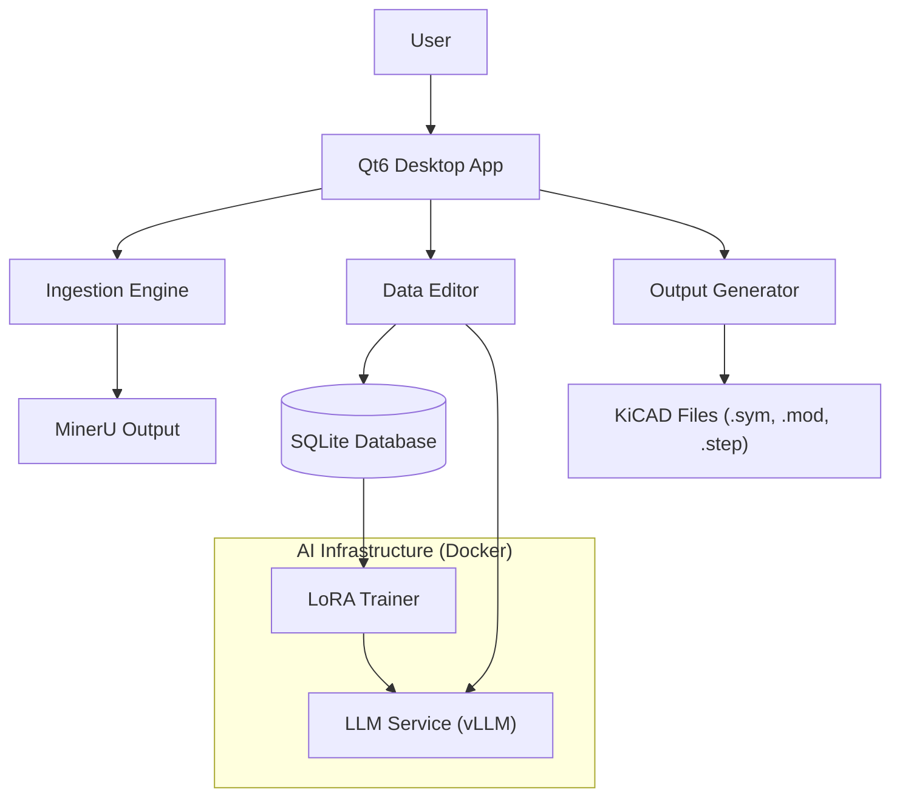

# Architecture Document: MinerU to KiCAD Component Generator

## 1. Executive Summary
This document defines the software architecture for an intelligent application that converts MinerU-processed datasheets into production-ready KiCAD components. The system leverages Large Language Models (LLMs) for data extraction, a Qt6-based GUI for user verification, and a LoRA-based active learning loop to improve performance over time.

## 2. System Architecture

### 2.1 High-Level Overview
The system is designed as a modular desktop application with containerized background services for AI tasks.

### 2.2 Core Components
1.  **Frontend (GUI)**: PySide6 application for interaction, PDF visualization, and data editing.
2.  **Backend Logic**: Python modules for data processing, validation, and file generation.
3.  **AI Services**: Dockerized containers for serving LLMs (`vLLM`) and fine-tuning (`Unsloth`).
4.  **Data Layer**: SQLite database for local persistence of component data and training logs.

## 3. Technology Stack

| Component | Technology | Rationale |
| :--- | :--- | :--- |
| **GUI Framework** | **PySide6 (Qt 6)** | Native look on Fedora, powerful widget set, mature ecosystem. |
| **Language** | **Python 3.10+** | Rich ecosystem for AI, CAD (CadQuery), and PDF processing. |
| **PDF Engine** | **PyMuPDF (fitz)** | Fast rendering to QImage, precise coordinate extraction for highlighting. |
| **Database** | **SQLite** | Zero-configuration, sufficient for single-user desktop app, portable. |
| **3D Modeling** | **CadQuery** | Parametric code-based CAD, robust STEP export via OpenCASCADE. |
| **LLM Serving** | **vLLM** | High-throughput inference, OpenAI-compatible API, supports LoRA adapters. |
| **Fine-Tuning** | **Unsloth** | Extremely fast and memory-efficient LoRA training. |

## 4. Data Architecture

### 4.1 Database Schema
The SQLite database serves two purposes: Component Library and Training Data.

-   **`datasheets`**: Tracks processed files (hash, path, metadata).
-   **`components`**: Stores extracted part numbers and descriptions.
-   **`packages`**: Stores package variants and **IPC-7351 dimensions** (JSON).
-   **`pins`**: Stores pinout tables (Number, Name, Electrical Type).
-   **`correction_log`**: **Critical for AI Learning**. Stores triplets of:
    -   `input_context`: The prompt sent to the LLM.
    -   `llm_output`: The original (potentially incorrect) response.
    -   `user_correction`: The verified data saved by the user.

### 4.2 Data Flow
1.  **Ingestion**: MinerU JSON/MD is parsed.
2.  **Extraction**: Heuristics identify sections; LLM extracts structured data (Pins, Dimensions).
3.  **Verification**: User reviews data in GUI. PDF highlights show source.
4.  **Correction**: User edits are saved to DB and logged to `correction_log`.
5.  **Generation**: Validated data is transformed into KiCAD files.

## 5. AI & Learning System

### 5.1 LLM Integration
-   **Model**: `Qwen-2.5-Coder-32B-Instruct` (or similar high-performance coding model).
-   **Prompting**: Multi-stage approach.
    -   *Stage 1*: Segment document (Pin table, Dimensions).
    -   *Stage 2*: Extract structured JSON from segments.
    -   *Constraint*: Strict JSON schema enforcement.

### 5.2 LoRA Fine-Tuning (Active Learning)
The system implements a "Human-in-the-Loop" workflow.
1.  **Collection**: Every "Save" action in the GUI potentially adds a training example if the user made changes.
2.  **Training Job**: A background Docker container runs `Unsloth`.
    -   Reads `correction_log`.
    -   Formats data into `(instruction, input, output)` pairs.
    -   Fine-tunes a LoRA adapter.
3.  **Deployment**: The new adapter is hot-swapped into the `vLLM` service.
4.  **Result**: The model adapts to the specific datasheets and correction style of the user.

## 6. User Interface Design

### 6.1 Layout
-   **Left**: Project/Component Tree.
-   **Center**: Interactive PDF Viewer.
    -   *Feature*: **Sync-Highlighting**. Clicking a pin in the table highlights the text/row in the PDF.
-   **Right**: Data Editor.
    -   *Pin Table*: Bulk editing, type dropdowns.
    -   *Package View*: Dimension fields + **Live 3D Preview** (using `PyVistaQt`).

### 6.2 Interaction
-   **"Magic Extract"**: Button to trigger LLM analysis on specific sections.
-   **"Visual Verify"**: Overlay bounding boxes on the PDF to show where data came from.

## 7. Output Generation

### 7.1 KiCAD Symbols (`.kicad_sym`)
-   Generates S-expressions.
-   Intelligent pin grouping (Power, Input, Output).
-   Visual consistency (standard box symbols).

### 7.2 IPC-7351 Footprints (`.kicad_mod`)
-   Uses IPC-7351B formulas to calculate pad stacks.
-   Supports Density Levels (Nominal, Least, Most).
-   Auto-generates compliant names (e.g., `QFN50P500X500X80-32N`).

### 7.3 3D Models (`.step`, `.wrl`)
-   **CadQuery Scripts**: A library of parametric scripts for standard packages (QFN, SOIC, BGA, etc.).
-   **Process**: The system injects extracted dimensions into the script to generate the model.
-   **Result**: Mechanical STEP file + Visual WRL file.

## 8. Deployment & Infrastructure

### 8.1 Hardware Requirements
-   **GPU**: NVIDIA RTX 3090 (x2 or x3) as provided.
-   **OS**: Fedora 42.

### 8.2 Container Strategy
-   **`llm-service`**: Runs `vLLM`. Ports: 8000.
-   **`trainer-service`**: Runs `Unsloth`. Ephemeral (runs only during training).
-   **`app`**: Runs natively on the host (GUI) to access X11/Wayland and filesystem.

### 8.3 File Organization
-   **Models**: `/data/projects/ai/huggingface/models`
-   **Output**: User-defined project directory (e.g., `~/KiCAD/Libraries`).

## 9. Validation
-   **IPC Compliance**: Code-based validation of dimensions.
-   **Physical Checks**: Sanity checks (e.g., "Pin pitch cannot be 0").
-   **ERC**: Basic Electrical Rule Checks on symbol pin types.
